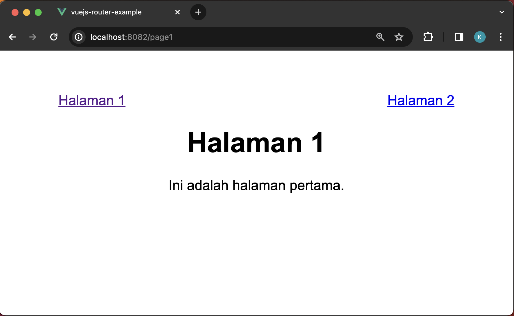
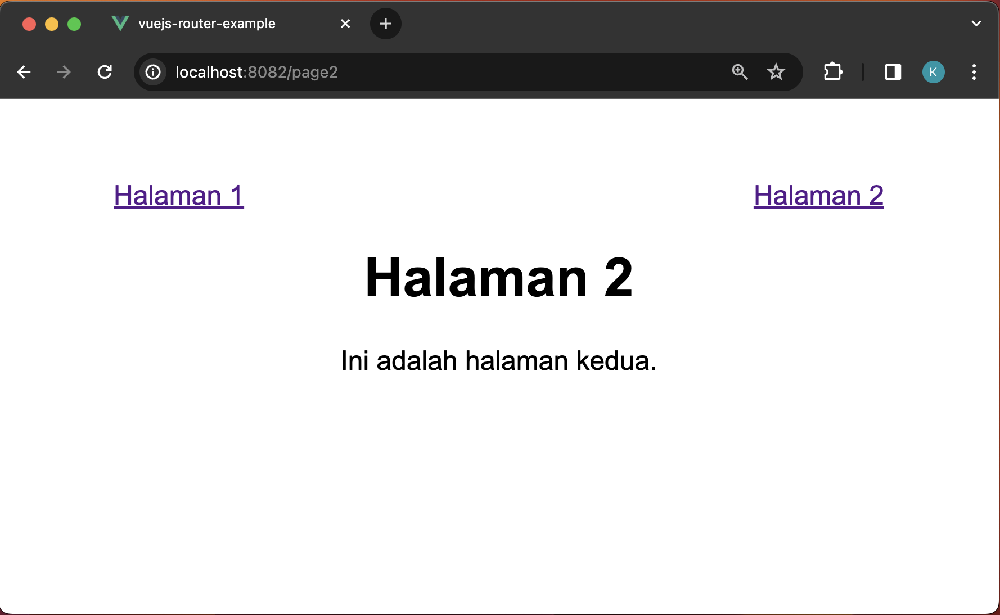

# Notes

build image

	❯ docker build . -t vuejs-router-example

run container

	❯ docker run -d --name my-vuejs-router -p 8082:82 vuejs-router-example

open browser

	URL http://localhost:8082

    

    

